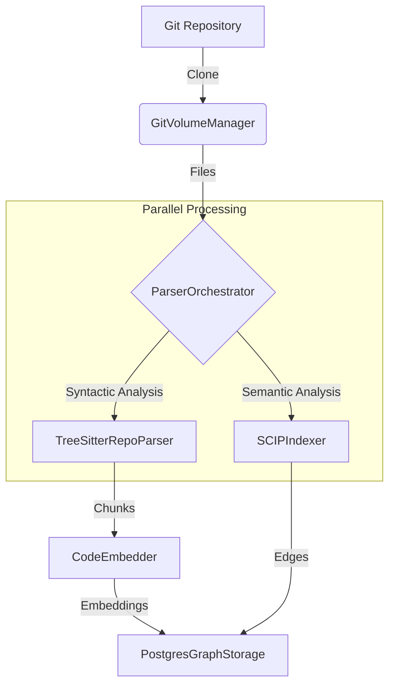
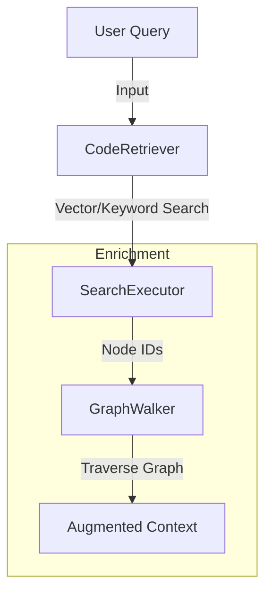

# System Architecture

This document describes the high-level architecture of **Crader**. The system is designed as a **Code Property Graph (CPG) Builder** that ingests source code repositories and transforms them into a queriable knowledge graph.

## High-Level Overview

The system operates in two main phases: **Indexing (Write Path)** and **Retrieval (Read Path)**.

### Write Path: From Git to Graph

### Read Path: From Query to Context

## Indexing Pipeline

The indexing process is orchestrated by `CodebaseIndexer`. It follows a **Snapshot-based** consistency model: every indexing run creates an immutable `Snapshot` of the repository.

### 1. Ingestion (`GitVolumeManager`)
*   **Role**: Manages the cloning and updating of Git repositories.
*   **Mechanism**: Uses `git` CLI (via `GitPython`) to fetch data.
*   **Optimization**: Maintains a persistent "Bare Repository" cache and creates lightweight `worktrees` for specific commits. This avoids re-downloading the entire history for every analysis.

### 2. Syntactic Parsing (`TreeSitterRepoParser`)
*   **Role**: Breaks down source files into "Chunks" (Functions, Classes, Methods).
*   **Technology**: Uses `tree-sitter`, a high-performance incremental parser.
*   **Logic**:
    *   Iterates over all files.
    *   Applies language-specific **S-expression queries** (`*.scm`) to extract definitions.
    *   Splits large files using a recursive "scope-aware" chunking strategy to preserve context.

### 3. Semantic Analysis (`SCIPIndexer`)
*   **Role**: Extracts cross-file relationships (e.g., `calls`, `inherits`, `imports`).
*   **Technology**: Wraps **SCIP (Source Code Indexing Protocol)** CLIs (e.g., `scip-python`, `scip-typescript`).
*   **Process**:
    *   Runs the language-specific indexer (often requiring a build environment).
    *   Streams the resulting Protobuf index.
    *   Resolves "References" to "Definitions" to create graph edges.

### 4. Embedding Generation (`CodeEmbedder`)
*   **Role**: Converts text code chunks into dense vectors.
*   **Pipeline**:
    1.  **Staging**: Chunks are written to a temporary table.
    2.  **Deduplication**: The system computes a hash of the content. If the same code block (same hash) was already embedded in a previous snapshot, the implementation reuses the existing vector.
    3.  **Delta Computing**: Only new/changed chunks are sent to the LLM API.
    4.  **Batching**: Requests are batched to respect API rate limits.

## Storage Layer (`PostgresGraphStorage`)

The persistence layer is valid PostgreSQL 15+ with the `pgvector` extension. It handles the **Code Property Graph (CPG)** schema, ensuring data integrity and high performance for both inserts and lookups.

**Key Responsibilities:**
*   **Snapshot Isolation**: Guarantees consistent reads during indexing updates (MVCC).
*   **Bulk Ingestion**: Uses `COPY` protocol for millions of rows/sec.
*   **Hybrid Indexing**: Manages IVFFlat/HNSW indexes for vectors and GIN indexes for keywords.

!!! tip "Full Specification"
    For a complete, exhaustive description of the Database Schema, Table structures, and Method behaviors, please consult the **[Storage API Reference](../reference/storage.md)**.

## Retrieval Architecture

The `CodeRetriever` implements a "Retrieval-Augmented Generation" (RAG) specialized for code.

### 1. Hybrid Search

Combines two search strategies:

*   **Dense Retrieval (Vector)**: Finds conceptually similar code (e.g. "auth logic" -> `login()`).
*   **Sparse Retrieval (Keyword)**: Finds exact matches (e.g. `UserFactory`, `API_KEY`).

### 2. Result Fusion

Uses **Reciprocal Rank Fusion (RRF)** to combine the ranked lists from Vector and Keyword search into a single, high-quality result set.

### 3. Graph Expansion (`GraphWalker`)

Once relevant "Seed Nodes" are found, the `GraphWalker` traverses the graph edges to fetch context that wasn't in the search results:

*   **Vertical Expansion**: "Who defines this function?" (Parent Class).
*   **Horizontal Expansion**: "What does this function call?" (Dependencies).

This ensures the LLM receives a complete subgraph rather than a disconnected snippet.
