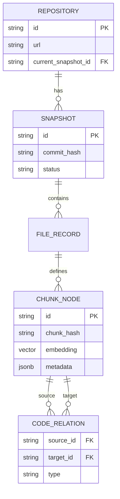

# Data Model

This document details the core entities and relationships in **Crader**.

## Entity Relationship Diagram

## Core Entities

### 1. Repository (`models.Repository`)
Represents a stable project identity.
*   **id**: Unique hash of the remote URL.
*   **current_snapshot_id**: Pointer to the currently active version of the code.

### 2. Snapshot (`models.Snapshot`)
Represents an immutable version of the code at a specific commit.
*   **Status Lifecycle**: `pending` -> `indexing` -> `completed` (or `failed`).
*   **Isolation**: Allows indexing a new commit in the background while serving queries from the old commit.

### 3. FileRecord (`models.FileRecord`)
Represents a physical file on disk.
*   **file_hash**: Content hash (SHA256) used for change detection.
*   **parsing_status**: Tracks if `tree-sitter` successfully parsed the file.

### 4. ChunkNode (`models.ChunkNode`)
The fundamental unit of the graph (a "Node").
*   **Granularity**: Can be a Function, Class, Method, or a standalone specific block of code.
*   **Vector**: Stores the 1536-dim embedding (if using OpenAI).
*   **Metadata**: JSONB field containing "semantic captures" (e.g., `role: entry_point`, `access: public`).
*   **Search**: Indexed via `nodes_fts` table using a weighted `tsvector` (A=tags, B=content).

### 5. CodeRelation (`models.CodeRelation`)
A directed edge between two ChunkNodes.
*   **Types**:
    *   `child_of`: Structural containment (Method -> Class).
    *   `calls`: Function A invokes Function B.
    *   `inherits`: Class A extends Class B.
    *   `imports`: File A requires Module B.
