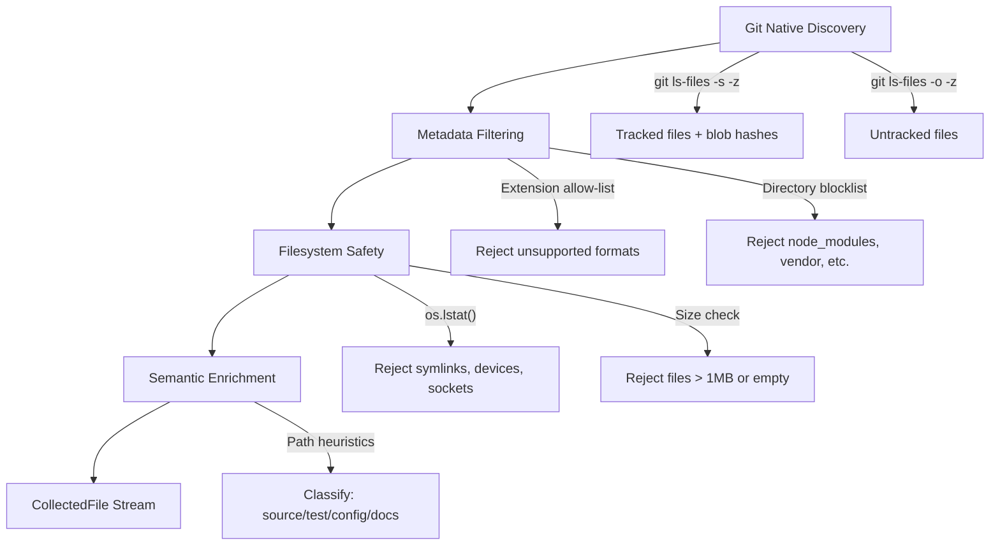
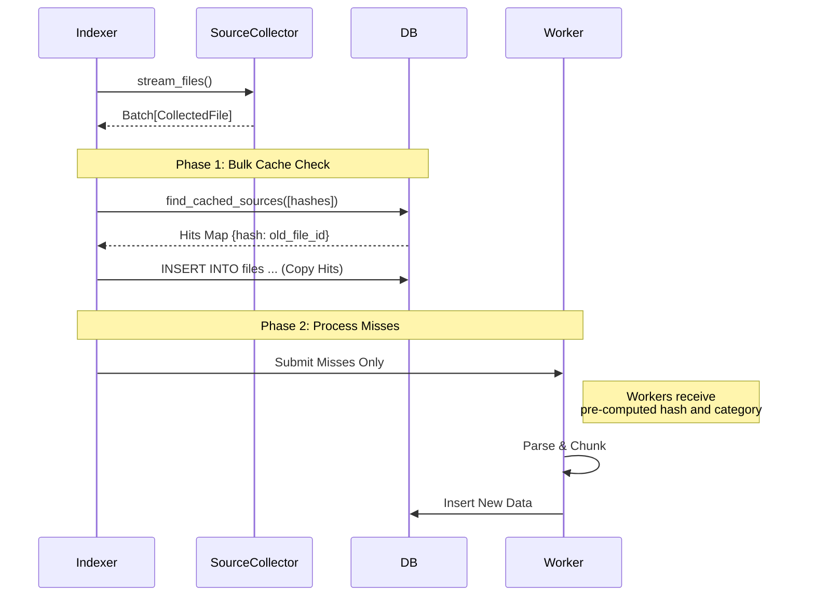

# SourceCollector: Git-Native File Discovery

**Last Updated**: January 27, 2026

---

## Table of Contents

1. [Overview](#overview)
2. [The Collection Funnel](#the-collection-funnel)
3. [CollectedFile Schema](#collectedfile-schema)
4. [Configuration](#configuration)
5. [Integration with Indexing Pipeline](#integration-with-indexing-pipeline)
6. [API Reference](#api-reference)
7. [Design Decisions](#design-decisions)

---

## Overview

The `SourceCollector` module provides a centralized, Git-native approach to file discovery and ingestion. It acts as the single gatekeeper between repository cloning and downstream parsing workers.

**Key Benefits**:

- **Zero-cost hashing**: Reuses Git's internal SHA-1 blob hashes instead of computing them manually.
- **Automatic `.gitignore` respect**: Delegates file enumeration to `git ls-files`, ensuring perfect compliance with ignore rules.
- **Semantic classification**: Files are categorized (`source`, `test`, `config`, `docs`) upfront, enabling cache-first workflows.
- **Safety guarantees**: Symlinks, oversized files, and blocklisted directories are rejected before any I/O occurs.

```python
from crader.collector import SourceCollector

collector = SourceCollector("/path/to/repo")

for batch in collector.stream_files(chunk_size=1000):
    for file in batch:
        print(f"{file.rel_path} ({file.category}) - {file.git_hash}")
```

---

## The Collection Funnel

The `SourceCollector` implements a four-stage filtering pipeline designed to discard invalid files as early as possible.



### Stage 1: Git Native Discovery

The collector executes two Git commands:

| Command | Purpose | Output |
|---------|---------|--------|
| `git ls-files -s -z --exclude-standard` | List tracked files | Path + SHA-1 blob hash |
| `git ls-files -o -z --exclude-standard` | List untracked files | Path only (no hash) |

Git provides:

- C-level performance for file enumeration
- Perfect `.gitignore` compliance
- SHA-1 blob hashes at zero computational cost

### Stage 2: Metadata Filtering

Fast, in-memory checks reject files without any filesystem I/O:

- **Extension filter**: Only files matching `SUPPORTED_EXTENSIONS` pass through.
- **Blocklist filter**: Paths containing directories like `node_modules`, `vendor`, `.git` are rejected.

### Stage 3: Filesystem Safety

Minimal I/O via `os.lstat()` ensures safety:

- **Symlink rejection**: Prevents infinite loops from circular symlinks.
- **Regular file check**: Rejects directories, sockets, and device files.
- **Size limits**: Rejects empty files and files exceeding `MAX_FILE_SIZE_BYTES` (default: 1 MB).

### Stage 4: Semantic Enrichment

Path-based heuristics classify files into semantic categories:

| Category | Detection Rules |
|----------|-----------------|
| `test` | Path contains `tests/`, `__tests__/`, `spec/`; filename starts with `test_` or ends with `_test.py`, `.spec.ts` |
| `config` | Files like `package.json`, `pyproject.toml`, `Dockerfile`, `Makefile`; extensions `.yml`, `.yaml`, `.toml` |
| `docs` | Path contains `docs/`, `documentation/`; extensions `.md`, `.rst` |
| `source` | Default category for all other valid files |

---

## CollectedFile Schema

Every file yielded by the collector is a `CollectedFile` dataclass:

| Field | Type | Description | Example |
|-------|------|-------------|---------|
| `rel_path` | `str` | Path relative to repository root | `"src/auth/login.py"` |
| `full_path` | `str` | Absolute path on disk | `"/workspaces/repo/src/auth/login.py"` |
| `extension` | `str` | Normalized extension (lowercase) | `".py"` |
| `size_bytes` | `int` | File size in bytes | `4096` |
| `git_hash` | `Optional[str]` | SHA-1 blob ID from Git. `None` if untracked. | `"a1b2c3d4..."` |
| `category` | `Literal` | Semantic classification | `"source"` |

### Properties

| Property | Type | Description |
|----------|------|-------------|
| `is_tracked` | `bool` | Returns `True` if `git_hash` is not `None` |

### Example Object

```python
CollectedFile(
    rel_path="tests/unit/test_api.py",
    full_path="/workspaces/uuid/tests/unit/test_api.py",
    extension=".py",
    size_bytes=1024,
    git_hash="e69de29bb2d1d6434b8b29ae775ad8c2e48c5391",
    category="test"
)
```

---

## Configuration

Configuration is defined in `crader.collector.config`:

### MAX_FILE_SIZE_BYTES

**Default**: `1048576` (1 MB)

Files exceeding this size are rejected. Large files are typically minified code, data files, or masked binaries.

### SUPPORTED_EXTENSIONS

The allow-list of file extensions that will be processed:

```python
{
    # Backend / Systems / Scripting
    '.py', '.pyi', '.go', '.rs', '.java', '.kt', '.scala',
    '.c', '.cc', '.cpp', '.h', '.hpp', '.cs', '.php', '.rb',
    # Frontend / Web
    '.js', '.jsx', '.ts', '.tsx', '.vue', '.svelte',
    '.css', '.scss', '.html',
    # Config / Data / Docs
    '.json', '.yaml', '.yml', '.toml', '.xml', '.sql', '.md', '.rst'
}
```

### BLOCKLIST_DIRS

Directories that are always rejected, even if tracked by Git:

```python
{
    '.git', '.svn', '.hg', '.idea', '.vscode',
    'node_modules', 'venv', '.venv', 'env',
    'dist', 'build', 'target', 'out', 'bin',
    '__pycache__', 'coverage', '.pytest_cache',
    'vendor', 'third_party'
}
```

---

## Integration with Indexing Pipeline

The `SourceCollector` enables a cache-first workflow where unchanged files skip parsing entirely.



### Cache Hit Rate

For incremental indexing of stable codebases, cache hit rates typically exceed **90%**, reducing indexing time from minutes to seconds.

### Why State-Based Sync?

The collector uses hash comparison against the database (state-based sync) rather than `git diff` (differential sync):

| Approach | Pros | Cons |
|----------|------|------|
| **State-based** (chosen) | Self-healing on failures; handles renames transparently; idempotent | Slightly higher overhead |
| **Differential** | Lower overhead | Fragile to failures; complex rename handling |

---

## API Reference

### SourceCollector

```python
class SourceCollector:
    def __init__(self, repo_root: str):
        """
        Initialize the collector for a Git repository.

        Args:
            repo_root: Path to the repository root directory.
        """

    def stream_files(self, chunk_size: int = 2000) -> Generator[List[CollectedFile], None, None]:
        """
        Yield batches of validated CollectedFile objects.

        Args:
            chunk_size: Number of files per batch (default: 2000).

        Yields:
            Lists of CollectedFile objects, sized according to chunk_size.
        """
```

### Instance Attributes

| Attribute | Type | Description |
|-----------|------|-------------|
| `repo_root` | `str` | Absolute path to the repository |
| `valid_exts` | `set[str]` | Set of allowed extensions |
| `blocklist` | `set[str]` | Set of blocked directory names |
| `max_size` | `int` | Maximum file size in bytes |

---

## Design Decisions

### Git as the Source of Truth

We delegate file discovery entirely to Git rather than using Python's `os.walk`:

| Approach | Performance | `.gitignore` Handling | Hash Availability |
|----------|-------------|----------------------|-------------------|
| `git ls-files` (chosen) | Fast (C-level) | Perfect compliance | Free from Git index |
| `os.walk` + `pathspec` | 3-5x slower | Imperfect edge cases | Must compute manually |

### SHA-1 as Cache Key

Git's blob SHA-1 serves as the primary cache key:

- **Zero cost**: Git computes these hashes during normal operations.
- **Cross-repository deduplication**: Identical files across repos share cached embeddings.
- **Collision risk**: Negligible for source code indexing (requires ~2^63 operations to produce malformed content).

### Untracked File Handling

Files not yet staged in Git (`git ls-files -o`) are collected but marked with `git_hash=None`. This enables:

- Indexing of work-in-progress files
- Differentiation in the UI (e.g., showing "uncommitted" badges)
- Graceful handling without requiring full Git history

### Symlink Rejection

Symlinks are rejected at the filesystem safety stage using `os.lstat()`:

- Prevents infinite loops from circular symlinks
- Avoids duplicate content when symlinks point to already-indexed files
- Ensures each `full_path` refers to exactly one physical file

---

*This guide is maintained alongside the codebase.*
